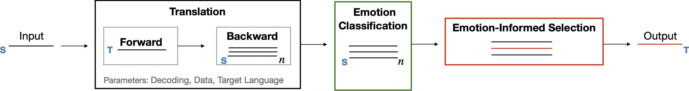

# Lost in Back-Translation

A NMT-based pipeline for the analysis of emotions in back-translations. The pipeline, described in [Lost in Back-Translation:
Emotion Preservation in Neural Machine Translation](http://www.romanklinger.de/publications/TroianoKlingerPado-coling2020.pdf), can be used to compare the emotion connotation of input texts vs. their back-translations (**RQ1** in the paper), to get a back-translation with the same emotion as the input text (**RQ2**) and to perform emotion style transfer via re-ranking of the generated hypotheses (**RQ3**). A visualization of the components is shown below.

<p align="center">

</p>

## Installation and Requirements
This project runs on [Python](https://www.python.org) version >= 3.7.0. Clone the repository and install the additional packages with:

```sh
$ git clone https://github.com/EnricaIMS/LostInBackTranslation.git
$ cd LostInBackTranslation
$ pip install -r Requirements.txt
```

### Translation Module

Download the pretrained [ensamble models](https://github.com/pytorch/fairseq/blob/master/examples/wmt19/README.md) of [Ng et al.(2019)](https://www.aclweb.org/anthology/W19-5333.pdf) and store them here: ```scripts/translation_module/translation_models```.


### Emotion Modules

Both the emotion-informed selection and the subsequent analysis of emotion change are based on an emotion classifier. 

Download and extract our pretrained BiLSTMs in ```emotion_module/trained-classifiers```. Each of them will output different emotion labels, as explained in the paper.

|[ISEAR](https://drive.google.com/file/d/1hX0ey3EcVCMdL8ZkQ4Y-YiEmVNT8T_Y2/view?usp=sharing)| [BLOGS](https://drive.google.com/file/d/1gA092woQIeh54omQStThvhLsStLOnH6l/view?usp=sharing) | [TALES](https://drive.google.com/file/d/1Oh0V6QQ1dW8j_uqRYwz4FHveUmAkxVPX/view?usp=sharing) | [TEC](https://drive.google.com/file/d/1KpfQne8l0QX3sybD3xu6RivUoC-K25eG/view?usp=sharing)|
|------------|------------|------------|------------|

## Pipeline Configuration

* **Data:** Put your own text in the folder ```data```. Alternatively, get the texts of our experiments:
  * run the [Unified Emotion Dataset](http://www.ims.uni-stuttgart.de/data/unifyemotion) script, which will download and store many emotion corpora;
  * move the resulting ```unified-dataset.jsonl``` into ```data/unified-corpora/```;
  * in the folder scripts, run ``` python -m emotion_module.extractdata```, which stores our texts in ```data```.

* **Parameter Setting:** Follow ```config/config-documentation.ini``` to set your ```config.ini``` file and specify the parameters of the pipeline, like the number of forward and back- translations, the dataset on which the classifier was trained, and the goal of pipeline usage (**RQ1**, or **RQ2**, or **RQ3**).


## Example Usage

Move to the folder ```scripts``` to classify the text before running the pipeline: automatically assigned labels will be used as input emotions.

```sh
$ python -m emotion_module.classify_emotions ../data/ISEARtest.txt
```

Next: translate, back-Translate and measure the change in emotions.

```sh
$ py -m main.py ../data/classified_input.txt
```

## Contact
For questions, please contact `enrica.troiano@ims.uni-stuttgart.de`.
